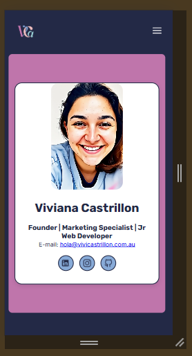
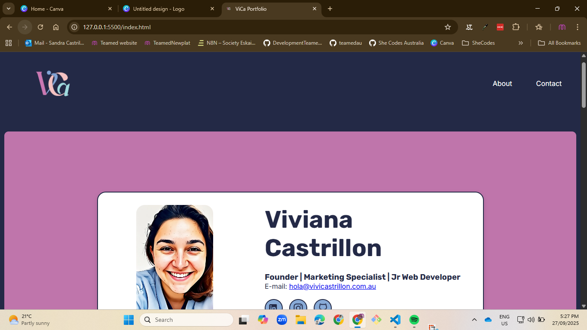
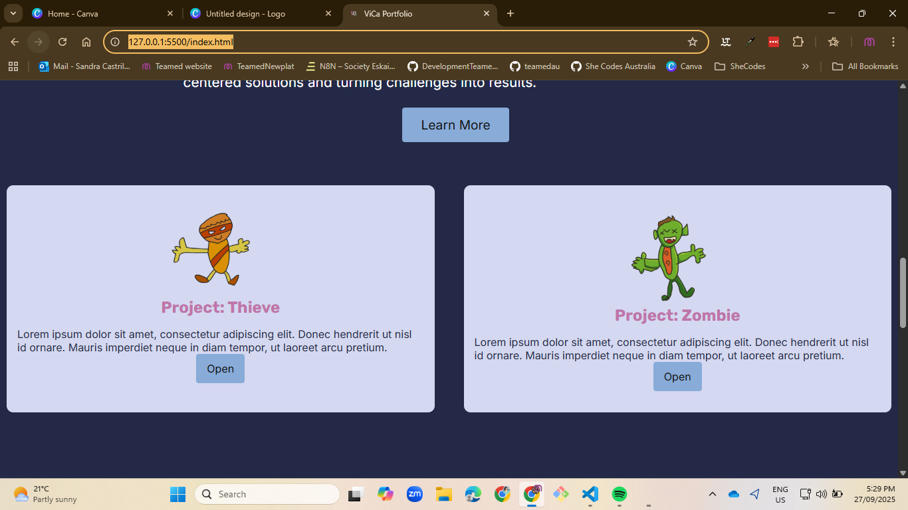
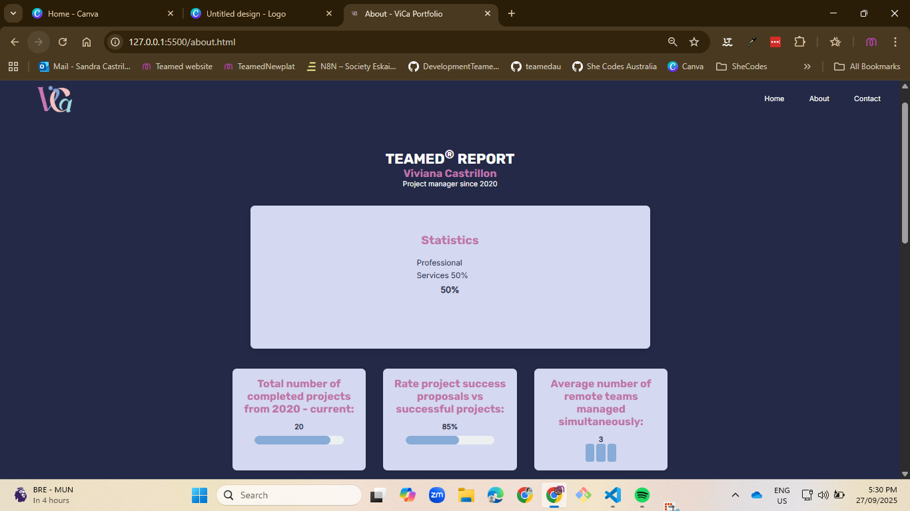

#  your_name_here - Portfolio Task
​
[My portfolio site](link_to_your_site)
​
## Project Requirements

### Content
 Add a short paragraph describing the features below. What aesthetic and technical choices did you make? 
- [ ] At least one profile picture
- [ ] Biography (at least 100 words)
- [ ] Functional Contact Form
- [ ] "Projects" section
- [ ] Links to external sites, e.g. GitHub and LinkedIn.
​
### Technical
 Add a short paragraph describing the features below. What strategies or design decisions did you work from? 
- [ ] At least 2 web pages.
- [ ] Version controlled with Git
- [ ] Deployed on GitHub pages.
- [ ] Implements responsive design principles.
- [ ] Uses semantic HTML.

### Bonus (optional)
 Add a short paragraph describing the features below, if you included any. 
- [ ] Different styles for active, hover and focus states.
- [ ] Include JavaScript to add some dynamic elements to your site. (Extra tricky!)
​
### Screenshots
> Please include the following:
> - The different pages and features of your website on mobile, tablet and desktop screen sizes (multiple screenshots per page and screen size).
> - The different features of your site, e.g. if you have hover states, take a screenshot that shows that.  
> - You can do this by saving the images in a folder in your repo, and including them in your readme document with the following Markdown code: 

## Content Requirements
###  Profile Picture/Video
In the profile picture I wanted to add an effect similar to Harry Potter newspaper where the images moves. I did this by taking a picture, add motion by AI and add it as video mp4 (./img/ViCa_animated.mp4)

### Biography
I just created a short bio mixing all my roles as a Founder, Marketing specialist and now as a Jr. Web Developer

### Contact Form
I used the contact form from the initial She Codes website example

### Projects
As I don't have any projects in web development, I asked my 8year old kid to draw some characters and I add them through out the whole page to add a bit of his artistic touch

### Links
I added funtioning links to LinkedIn, Instagram and GitHub

## **Description Paragraphs**

### Basic Website Features Overview
When I deployed, I initially had a nested website, because the repo name was missing the au at the end. This was a challenge to fix so Ali helped me fix it! And now it is live at the correct url.

### Technical Challenges I Faced
The nav menu was hard!

### Two pages
I decided to leave Home and About as my two pages, they are link from the menu forward and backwards

### Version controlled with Git
I used Git for version control to track changes, experiment safely, and keep a clear history of the project’s development. I also created a main version, the development was on a branch and once I was happy with the result, I merge them and deployed

### Deployed on GitHub Pages
The site was deployed using GitHub Pages, making it publicly accessible without needing a paid server. 

### Implements responsive design principles
I applied responsive design techniques, like flex-box and media queries, so the site adjusts smoothly to different screen sizes. This ensures accessibility and usability on both desktop and mobile devices.

### Uses semantic HTML
I structured the website with semantic HTML elements (like header>, section>, article>), which improves readability, accessibility for assistive technologies, and overall SEO. 

## **Bonus**
Ally helped me to add Java Script to the mobile menu for this to work 

## **PrintScreens**

### 1. Mobile View

### 2. Desktop View

### 3. Rafa Drwing Characters

### 4. About Page

